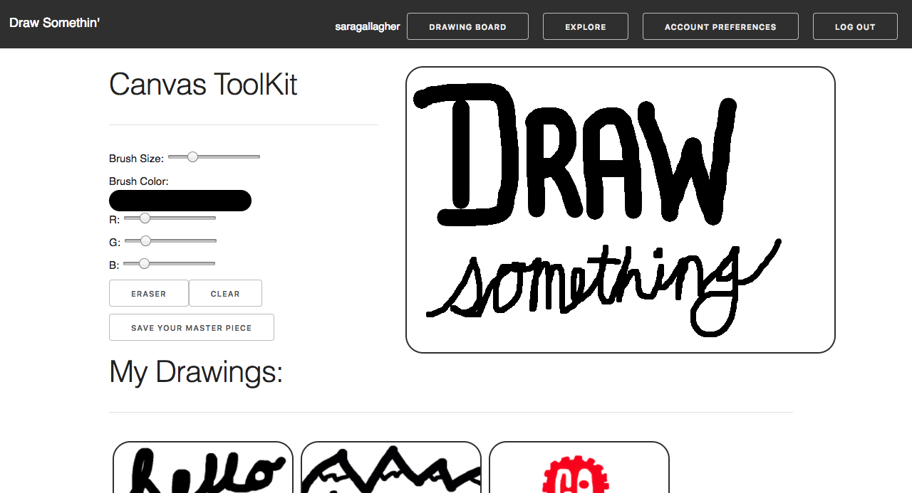

#Project Four: Draw Somethin'

Draw Somethin' is a drawing app where users can create, edit, and delete their drawings, as well as view othe users master pieces. This app allows for users to choose different brush sizes, and different brush colors. 

###Technologies Used: 
- Node.JS
- JavaScript
- HTML
- CSS
- Mongoose
- MLab
- Heroku
- Axios
- React
- Skeleton CSS

###NPM Packages Used: 
- bcrypt-nodejs
- body-parser
- cors
- express
- jsonwebtoken
- mongoose
- morgan
- axios
- react alert

###Installation Instructions: 
1. Go to github and copy the repositories clone url.
2. Go to your terminal and do a ``git clone`` "the copied repo's url"
3. run ``npm install`` in the terminal

##Wireframes:

###Major Hurdles:
- Getting the image update functionality working
- Having the draw function follow the mouse
- Understanding how to use the HTML canvas in react
- For the future: I would like to edit the image by dragging and dropping it

###User Stories: 
- As a user I when I arrive at the app I want to be able to use the drawing canvas, and view all drawings that belong to all users
- Onced logged in I want to see the all of the tools available with the canvas, and my saved drawings
- Be able to log in, sign up, and update account settings